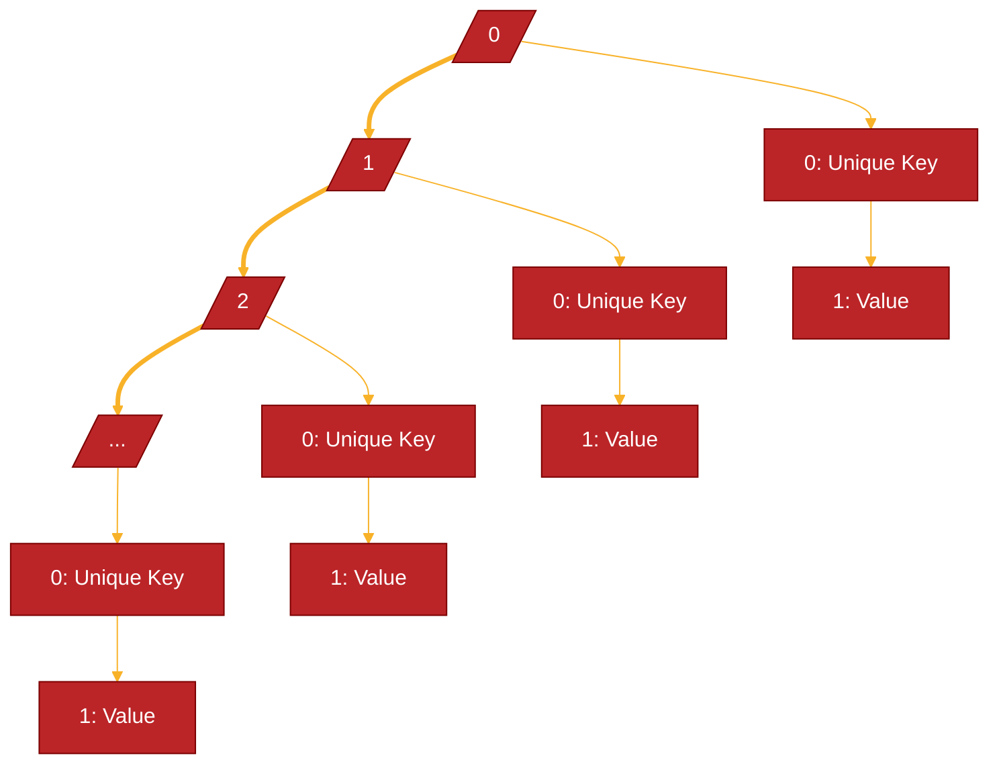

# Backgroud structure

## Arrays structure.
The dictionary is implemented as a multidimensional array, where the first dynamic array contains on every cell a fixed array of two cells. 
The first fixed array cell contains the unique key and the second one contains the value. 

### Chart

