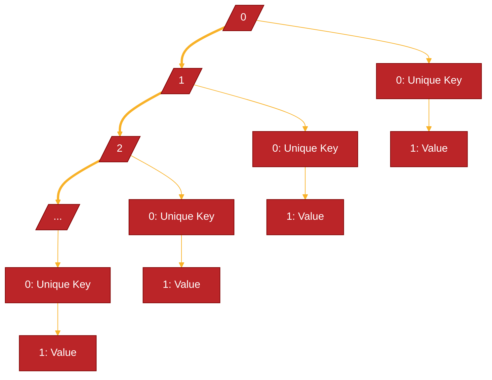

# Dictionary in Classic ASP

[](https://app.codacy.com/gh/R0mb0/Dictionary_classic_asp/dashboard?utm_source=gh&utm_medium=referral&utm_content=&utm_campaign=Badge_grade)

[](https://github.com/R0mb0/Dictionary_classic_asp)
[](https://github.com/R0mb0/Dictionary_classic_asp)
[](https://opensource.org/license/mit)

[](http://paypal.me/R0mb0)

## Backgroud structure

### Arrays structure.
The dictionary is implemented as a multidimensional array, where the first dynamic array contains on every cell a fixed array of two cells. 
The first fixed array cell contains the unique key and the second one contains the value. 

#### Chart


<details>
  <summary> 

 ## `Dictionaries.asp`'s avaible Functions
  
  </summary>

- **Initialize an array as a dictionary** -> `get_initialized_dictionary()`
- **Add an element into a dictionary** -> `add_element_to_dictionary(dictionary,key,value)`
- **Get value from key** -> `get_dictionary_value_from_key(dictionary,key)`
- **Set value from key** -> `set_dictionary_value_from_key(dictionary,key,value)`
- **Change a key into dictionary** -> `change_dictionary_key(dictionary,old_key,new_key)`
- **Remove dictionary element from key** -> `remove_dictionary_element_from_index(dictionary,idx)`
- **Remove dictionary element from index** -> `remove_dictionary_element_from_index(dictionary,idx)`
- **Remove last element from dictionary** -> `remove_last_element_from_dictionary(dictionary)`
- **Remove elements from dictionary using indices (pass to function an array with the indices)** -> `remove_dictionary_elements_from_indices(dictionary,indices)`
- **Remove all elements with the same value from dictionary** -> `remove_dictionary_elements_from_value(dictionary,value)`
- **Replace all value occurrences with a new value in dictionary** -> `replace_all_value_occurrences(dictionary,old_value,new_value)`
- **Get key index from dictionary** -> `get_key_index_from_dictionary(dictionary,key)`
- **Reset a dictionary** -> `get_initialized_dictionary()`
- **Get dictionary key from index** -> `get_dictionary_key_from_index(dictionary,idx)`
- **Get first value index occurrence** -> `get_first_value_index_occurrence(dictionary,value)`
- **Get all indices of a value** -> `get_all_value_indices(dictionary,value)`
- **Check if a key has been used into dictionary** -> `check_if_key_has_been_used(dictionary,key)`
- **Check if a value is present in the dictionary** -> `check_if_value_is_present(dictionary,value)`
- **Get dictionary value from index** -> `get_dictionary_value_from_index(dictionary,idx)`
- **Get dictionary dimension** -> `get_dictionary_dimension(dictionary)`
- **Write a dictionary** -> `write_dictionary(dictionary)`

## How to use: 

> From `Test.asp`

1. Create array and initialize it as dictionary
   ```
   <!--#include file="Dictionary.asp"-->
   <%
   Dim dictionary
   dictionary = Array()
   dictionary = get_initialized_dictionary()
   ```
2. Pass the dictionary to functions for manage
   ```
   add_element_to_dictionary_array dictionary,"0001","Ice ice baby"
   add_element_to_dictionary_array dictionary,"0002","Dove lo vuoi tu"
   add_element_to_dictionary_array dictionary,"0003","Hot shot"
   write_dictionary dictionary
   %>
   ```
   </details>
